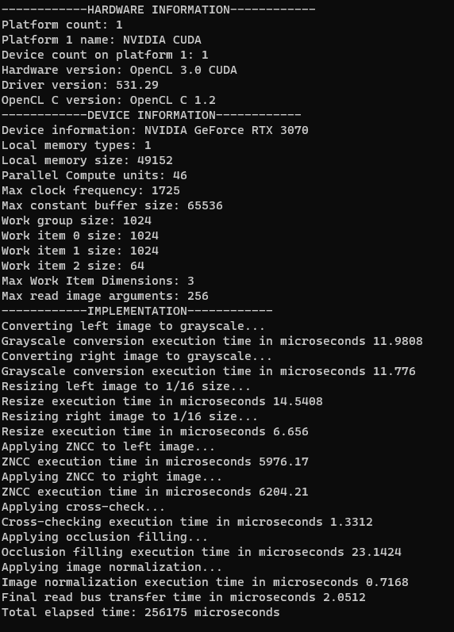

# Multiprocessor Programming Training Diary
**Name:** Filip Georgiev

**Student number:** 2208085

The purpose of this training diary is to showcase the student’s journey with OpenCL (in C++). The document will be split into the pre-set phases of the exercise project for the Multiprocessor Programming course, done in the University of Oulu.

This project was implemented with Visual Studio and consequently the MSVC compiler. An example [property list](GlobalSheet.props) for Visual Studio is given with necessary compiler flags. 
The property list also includes include and library directory paths, that need to be changed on every machine. Put your paths for OpenCL and Lodepng in the following two tags: **AdditionalIncludeDirectories** and **AdditionalLibraryDirectories**. (This has not been tested on a machine other than Windows 11)

The Nvidia CUDA OpenCL SDK and runtime were used for the implementations found in this repository.

## Start
Open MPP_Project.sln with Visual Studio, choose a project from the projects that will be listed in bold below, and set it as startup, before building and running.

The Lodepng library was imported as a submodule with the intention to decode and encode PNG images.

## Phase 0 (3 hours)
To get familiar with OpenCL, the [linked video](https://www.youtube.com/playlist?list=PLzy5q1NUJKCJocUKsRxZ0IPz29p38xeM-) tutorial series was watched. Watching the videos and following along, while also doing some online exploration took around 3 hours. 
## Phase 1 (27 hours)
### Step 1 (9 hours)
The **CPU_Moving_Filter** project contains the code for step 1 (lodepng read/write, grayscale and resize). 
The code also implements a 5x5 Gaussian blur moving filter on CPU. 

The original and processed images can be found in the ```img/``` folder. 
The two original images used are ```im{0/1}.png``` and were gotten from [here](https://vision.middlebury.edu/stereo/data/scenes2014/datasets/Backpack-perfect/).


The original image, seen above, had RGBA colour type.
This meant that it had four channels for each colour and opacity, i.e. the size of the image would be 4 times bigger than its resolution (width * height).
This was taken into account while decoding with lodepng.
After converting the resulting raw vector to grayscale by adding up the R, G and B values and discarding the A value, its size would become the same as the resolution.

As per the assignment, the image was further downsized to 1/16th of its size by dividing the image into 4x4 blocks and using the average value of the block as the value of the new pixel.


The processed image was then further manipulated by applying gaussian blur. This was done with the help of a 5x5 moving filter.
As can be seen below, the image is considerably blurrier.


The images are then decoded with lodepng. 
The results are displayed above.

Pure code can be found in [moving_filter.cpp](moving_filter.cpp).

This step took 9 hours, as the writer is not familiar with image processing.

### Step 2 (8.5 hours)
Step two is divided into two parts - implementing matrix addition with C on the CPU and then implementing the same with OpenCL on the GPU.
The C code can be found in the [Matrix_Addition_C](Matrix_Addition_C/) folder (together with compilation instructions).
It makes use of Windows.h's QueryPerformanceCounter functionality to track how long matrix addition takes.
The resulting time is shown below.


The OpenCL implementation is in the **Matrix_Addition_OpenCL** project.
An issue encountered was trying to pass a 2D dynamic array into the buffer.
To resolve this issue, the array was flattened into a pointer to a 1D array.
The dimensions from the perspective of the kernel were still 2, but this is done so that the kernel has access to the rows and columns.
Implementing matrix addition with OpenCL made execution around 10 times faster, as seen below.


The OpenCL code can be viewed in [matrix_addition.cpp](matrix_addition.cpp), while the respective kernel used in [kernels/add_matrix.cl](kernels/add_matrix.cl).

This step took around 8.5 hours, due to this being the first real attempt at OpenCL.

### Step 3 (5.5 hours)
Step three made use of all the knowledge obtained previously in this phase to create an OpenCL implementation, which converts an image to grayscale and applies a 5x5 moving filter, similarly to step 1.
However, no resizing was applied in this case.
Two kernels were created for this implementation. The first one, would take an image as an input and convert it to grayscale, while the second one would take the output of the previous kernel as an input, together with a gaussian filter matrix and apply the latter to the former, so as to achieve Gaussian blur.
It's important to note that the two kernels were kept in one kernel file, as C++ did not allow for them to be input separately.

The OpenCl implementation is in the **OpenCL_Moving_Filter** project.
After decoding the raw image, similarly to step 1, it was passed to the first kernel.
As this implementation did not make use of a for loop, iterating every four indexes had to be done in a different way.
Each work item would check whether its ID is a multiple of four.
If it is, it would add up its own value and the next two ones, essentially adding up the R, G and B channels.
If not, it would just skip over to the next work item.

The second kernel did not need to change the moving filter code with the exclusion that it removed the iterations over the width and height of the image, similarly to the kernel from the previous step.

As the image was basically a 2D array it could be seen as a matrix from the previous step.
This meant that it had to be handled in a similar way.

The final result was encoded and can be found [here](img/imCV_out.png).
As the image is not resized, the blur is not as noticeable, but can be seen if closely inspected.

The following information is printed on execution. 


As can be seen, loading and saving the image takes much more time than the OpenCL-enabled processing functions.
Expectedly, the grayscale conversion is faster than the gaussian filter.
The bus transfer time, while reading the processed image, is also shown for both kernels.

The OpenCL code can be investigated in [image_manipulator.cpp](image_manipulator.cpp), while the kernels can be seen in [kernels/image_manipulator_kernels.cl](kernels/image_manipulator_kernels.cl).

This step took around 5.5 hours.

The whole phase took 27 hours, as an additional 4 hours were spent documenting the whole journey so far :)

## Phase 2 (19 hours)
In Phase 2, the ZNCC disparity algorithm was implemented in C++ and is located in the **CPU_ZNCC_Implementation** project.
This implementation was done on the CPU and it used 5 nested for loops.
At first, the internet was scoured for an actual C++ example, but none was found.
Some python implementations were seen, but they seemed to differ from the supplied mathematical model.
For this reason, ChatGPT was used.
It gave a lot of insight and code examples of how ZNCC can be implemented, but the prompts used had to be extremely constraint, as ChatGPT wanted to use C++ libraries like ```algorithm``` or ```opencv```.
Nevertheless, even with the correct prompts, the C++ implementation supplied by ChatGPT was, as expected, littered with errors, assumptions and it kept adding a standard deviation calculation.
Because of this, it was decided that the algorithm model will be translated to C++ by hand.
Thankfully, working with ChatGPT and trying to get it to work properly led to a lot of insight on how the algorithm worked and there was still some code that could be reused from ChatGPT's answers.
The implementation (with a window size of 11 and the original images resized to 1/16th of the size) provided the following two images (first = using left image as based, second = using right image as base).


After this, ChatGPT was used similarly to get algorithms for cross-checking and occlusion filling.
The same issue was encountered as before, so the code had to be rewritten by hand.
At first, the results were not ideal as the parameter values of the the functions had to be tweaked.
The parameters in question are the difference in disparity allowed during cross-checking and the amount of neighbours in occlusion filling.
The neighbours in the latter were used to create a window of neighbouring pixels, whose median would be used to fill in holes created by the former (places were the cross-checking difference allowed was exceeded).

The resulting images at this point were as follows.


The parameter value for both cross-checking difference and neighbour count was 8.
As can be seen, there is no difference between the images.
At this point, 15:30 hours had been spent.

After consulting with the teacher responsible, some ideas of why these issues were happening were given.
One issue would be that cross-checking would mark pixels that exceeded the allowed difference as invalid, by making the pixel have a value of 0.
However, the occlusion-filling function would not take this into account.

Even though this seemed like a valid reason for the observed issue, amending this did not lead to a better result.
Only after changing both the cross-checking difference and neighbour count parameters to have the value of 32, was the final result acceptable.
The successful implementation of the cross-check and occlusion-filling can be seen below respectively.


Fixing the issues took an extra 3:30 hours.

Finally, the execution time was measure with Windows' ```QueryPerformanceCounter()```.
The total time that it took for the images to be resized, converted to grayscale and go through the rest of the ZNCC pipeline was around 8 minutes as can be seen in the following image.


Visual Studio's ```Performance Profiler``` was also used to check the CPU metrics.
Overall, the CPU usage did not go above 10%, which is to be expected in a single-processor implementation.
The CPU usage graph produced by Visual Studio can be seen below.


The code can be investigated in [CPU_ZNCC_Implementation/zncc.cpp](CPU_ZNCC_Implementation/zncc.cpp).

The whole phase took 19 hours.

## Phase 3 (3:00 hours)
CPU parallelization of the ZNCC pipeline implemented earlier was done in Phase 3. 
The improved implementation (which is very slightly different than the original) can be found in the **OpenMP_ZNCC_Implementation** project

Parallelization was done through OpenMP. 
The /openmp command-line argument was first added in the Visual Studio property sheet of the project, so as to allow the usage of OpenMP.
Then, this [tutorial](https://bisqwit.iki.fi/story/howto/openmp/) was used to understand OpenMP better.

The main way threading was introduced to the implementation was by decorating the code with either ```#pragma omp parallel for``` in independent for-loops, or ```#pragma omp parallel for collapse(2)``` in places where 2x nested loops were used.
This command would tell OpenMP to create a thread for each nested iteration.

Adding ```reduction(+:<variable>)``` was also investigated for the ```ResizeImage``` function and the mean calculation of the ZNCC algorithm as they use variables that can benefit from parallel recurrence calculations, but that did not add any time improvements, so the reductions were removed.

Overall, using OpenMP added a significant improvement in speed.
As can be seen by the image below, the implementation which previously took 8 minutes is now completed in around 1 minute - an 8x improvement.


The creation of threads by OpenMP leads to more CPU usage as expected.
In comparison to the previous phase, this time around between 85 and 90% of the CPU is utilized.
The image below shows this and the speed of the implementation.
It was interesting to note that profiling affects the speed.


The "hole" in CPU utilization in the middle is interesting to note.
The usage there is around 30% and as far as the profiler can show, it is caused by the parallelization of the for loop, which iterates over the disparity values.
One idea why this is happening is that there are only 260 disparity values, so the loop can be parallelized only so much.
In all other cases, parallelization is done on pixel iteration, so the max value of the parallelized for loops is much higher as it equals the ```width * height``` of the image.
This means that many more threads can be created in the latter case than in the former case.

Implementing this took around 2 hours.

Offloading some of the work to the GPU with OpenMP was also investigated.
Based on the tutorial mentioned earlier, this could be done as easy as just declaring the GPU as a target for OpenMP and then running a target specific command ```#pragma omp target teams distribute parallel for``` or the *collapse* version for nested loops.
In this scenario the copying the data to and from the target must also be taken care of, similarly to how it is done in OpenCL.
Sadly, the MSVC version of OpenMP [does not have support](https://devblogs.microsoft.com/cppblog/improved-openmp-support-for-cpp-in-visual-studio/) for GPU offloading yet, so it was not possible to test how offloading would affect the algorithm run time.

An additional one hour was spent on the GPU offloading investigation.

The code can be investigated in [OpenMP_ZNCC_Implementation/zncc_openmp.cpp](OpenMP_ZNCC_Implementation/zncc_openmp.cpp).

Overall, this phase took around 3 hours.

## Phase 4 (13:15)
In phase 4, the ZNCC pipeline's speed was optimized with OpenCL.
This implementation can be seen in the **OpenCL_ZNCC_Implementation** project.

First, two kernels were created to process the read image, convert it to grayscale and resize it to 1/16 of its original size.
Instead of using normal buffer objects to pass the images to the device, OpenCL's ```Image2D``` objects were used.
This made converting to grayscale easier, as image objects in OpenCL can take into account that a single pixel can have multiple channels for its color values.
By creating an ```ImageFormat``` object, the bit depth and data type of the channel can be given to the Image2D object.
Then, similarly to the usage of buffers, the image object can be passed to the device through the kernel's arguments.
The reason, why this method makes conversion to grayscale easier (or more precisely - cleaner) is because, instead of manually adding up the R, G and B values of the raw image and skipping every four bytes like we did [previously](kernels/image_manipulator_kernels.cl), we can simply access the x, y and z values of a special 4-byte unsigned int struct the Image2D object uses for encoding.
By using the special OpenCL functions ```read_imageui()``` and ```write_imageui()``` these pixels can be decoded and encoded back to an output image respectively.
How this is done can be seen in the [convert_grayscale](kernels/zncc_kernels.cl) kernel.

After this, the same output image is directly passed to a kernel, which resizes the image, without reading the output on the host device.
This is done to avoid unnecessary data transfers.
The [resize_image](kernels/zncc_kernels.cl) kernel works similarly to the grayscale one, as it also takes Image2D as an input.
As the [original CPU resizing function](moving_filter.cpp) was applied to a raw 1D vector, some minor changes had to be applied to the kernel implementation.
A considerable time was spent investigating how to have differently-sized input and output objects for the kernel.
At first, the author was unsure whether enqueuing the kernel was supposed to be done with the size of the input or output object.
After figuring out through ChatGPT that the latter was the case, the [code](OpenCl_ZNCC_Implementation/zncc_opencl.cpp) was changed to reflect that.
The time spent so far was around 7 hours.

Initially, the output of this function was also an Image2D object.
However, it was changed to a 1D buffer, as this would make it easier to parse in the ZNCC kernel later on.
To correctly encode the 2D image to the 1D buffer, the output width had to be known.
To implement this, three iterations were done.
The first implementation was done by using the ```get_image_width()``` function on the input image and then dividing it by ```resize_factor```.
However, this incurred needless calculations.
Instead, passing the width as an argument was considered.
However, the best solution was finally discovered in the ```get_global_size(0)``` function, which gives the width of the kernel itself, which is the same as the output buffer's.
All of this was applied to both left and right image
The above took an additional 1:15 hours.

Next, the zncc algorithm, the cross-checking, occlusion filling and normalization parts of the pipeline were converted to their own kernels.
These kernels took a buffer as an input and provided a buffer as an output.
Similarly to before, this was done to minimize device-host transfers.
The output was finally read after normalizing the disparity.
These four kernels can be found [kernels/zncc_kernels.cl](kernels/zncc_kernels.cl) as ```calc_zncc```, ```cross_check```, ```occlusion_filling``` and ```normalize_to_char```.
Separate kernels were created as these parts of the pipeline were sequential and had nested loops which could be unrolled and ran on the GPU.
Code-wise, the kernels had very little note-worthy things about them.
They were all 2D kernels so that the work-items created can each take care of one pixel. 
Lessons learned from the resizing kernel were applied here as well, so that the width and height are not passed as arguments, but gotten from the kernel functions.
The ZNCC kernel could be optimized to use a 3D kernel, so that a work item is applied on one disparity calculation, but as this optimization had to make use of local memory and memory blocks it was left for the next phase.
The occlusion filling implementation required a variable size array to be created to keep track of the neighbors which it uses to fill in invalid pixels.
As this is not possible in C, a local pointer was initialized with the size of the neighbourhood in the kernel.
This was done by passing it as a local argument.
Kernel profiling was used to benchmark the execution time of each kernel.
Below, a table can be seen which shows the kernel and its respective time.

| Kernel                    | Time (microseconds)|
| :---                      |    :----:          |
| convert_grayscale (left)  |  11.9808         |
| convert_grayscale (right) |   11.776           |
| resize_image (left)       | 14.5408             |
| resize_image (right)      |  6.656              |
| calc_zncc (left)          | 5976.17            |
| calc_zncc (right)         |  6204.21           |
| cross_check               | 1.3312             |
| occlusion_filling         | 23.1424             |
| normalize_to_char         | 0.7168             |

The total execution time of the kernels is around 12 394 microseconds (12 milliseconds).
The bus transfer done by reading after normalization takes an additional 2.0512 microseconds.
Window's ```QueryPerformanceCounter``` was used to track the execution time from loading the kernel and until after the buffer has been read.
According to it, the total execution time took 256 175 microseconds (256 milliseconds).
This is quite the improvement to openmp and the original implementation.

Below, an image that prints out these execution times with information about the device can be seen.



Implementing the rest of the ZNCC pipeline took 5 hours.
The phase took in total 13:15 hours

## Phase 5 ()
Phase 5 was all about the optimization of the implementation created in the previous phase.
The code was copied into a new project called **OpenCL_ZNCC_Optimized** and optimized by doing the following steps.

The first step was to change the memory access of the only input buffer from ```CL_MEM_COPY_HOST_PTR``` to ```CL_MEM_USE_HOST_PTR```.
THe logic behind this was that copying memory, rather than directly using already allocated memory would be slower.
After this change a small speed-up of around 15 000 microseconds was observed.
At this point it was observed that each time the code was run a different speed could be seen.
Sometimes it was slower, while others it was faster than the original values written down in the previous phase.
Nevertheless, the speed up from changing the memory access can be positively identified, because the program was run with the original copy method multiple times and even though the speed differed, it was never as fast as in some iterations, where the "use" memory access mode was utilized.
For the rest of this phase it can be assumed that if an optimization is mentioned, it has been tested multiple times to ensure that it actually has some kind of effect.

Next, the ```calc_zncc``` kernel was updated with openCL math functions. 
The denominators for the zncc value were initially calculated with the math functions ```pow``` and ```sqrt```.
However, as it is known that the power will be an integer, the ```pown``` function could be used to optimize the implementation.
The ```native_powr``` function was attempted, so as to use any native GPU implementations, but this led to the final image not being output correctly.
However, the ```native_sqrt``` function did work and was used in place of the normal ```sqrt``` function.
Finally, ```native_divide``` was used to calculate the means and zncc value.
All of this added an additional speed up of the implementation of around 80 000 microseconds.
The ZNCC kernel itself was 5 times faster than before.

Any variables that would only be read in the kernels were made ```constant```.
The ```window_size``` argument in the ZNCC kernel was changed to ```half_window_size``` so that the calculation of the half window size is done only once, outside of the kernel instead of each work item iteration.
These changes did not bring and noticeable speed-up, but were kept as they seemed like better practice.


5h
20:00 
#TODO: 3D ZNCC Kernel